# 🎵 Music Recommender Simulation

## Project Summary

In this project you will build and explain a small music recommender system.

This project is a content-based music recommender simulation built in Python. It scores every song in a 20-song catalog against a user's stated preferences — favorite genre, preferred mood, and target energy level — and returns the top 5 matches with scores and plain-language explanations. The system includes two scoring paths: a dictionary-based recommender used by the command-line runner, and an object-oriented Recommender class used by the test suite. It also supports building a user profile automatically by averaging the features of songs a user has already liked.

---

## How The System Works

Explain your design in plain language.

Some prompts to answer:

- What features does each `Song` use in your system
  - For example: genre, mood, energy, tempo
- What information does your `UserProfile` store
- How does your `Recommender` compute a score for each song
- How do you choose which songs to recommend

You can include a simple diagram or bullet list if helpful.

Mermaid Diagram:
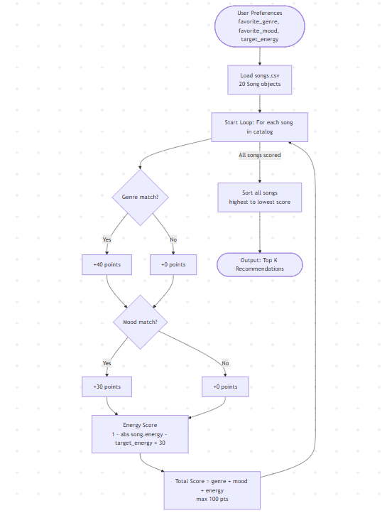

Real-world recommendations work by combining collaborative filtering with content-based filtering. Collaborative filtering means that the system finds users with similar tastes, and content-based filtering means that features of similar songs (bpm, mood, etc.) are matched. My system will focus on content-based filtering which means it will score songs based on the preferences of a user.

The features that the Song object will use are: genre, mood, energy, tempo_bpm, and acousticness.

The features the UserProfile object will include and store are favorite_genre, favorite_mood, target_energy, and likes_acoustic.

### Scoring Plan

The Recommender scores every song in the catalog using a 100-point system:

| Feature | Points | Logic |
|---|---|---|
| Genre match | +40 | Exact match on genre string |
| Mood match | +30 | Exact match on mood string |
| Energy similarity | 0–30 | `round((1 - abs(song.energy - target_energy)) * 30)` |

**Why these weights?** Genre is the strongest signal — a user who wants lofi won't enjoy metal even if the mood matches. Mood is the next most important signal because it reflects emotional state. Energy uses a sliding scale so songs that are close to the target still earn partial credit rather than scoring zero.

Every song receives a score between 0 and 100. The system sorts all songs from highest to lowest and returns the top K results.

### Data Flow Diagram

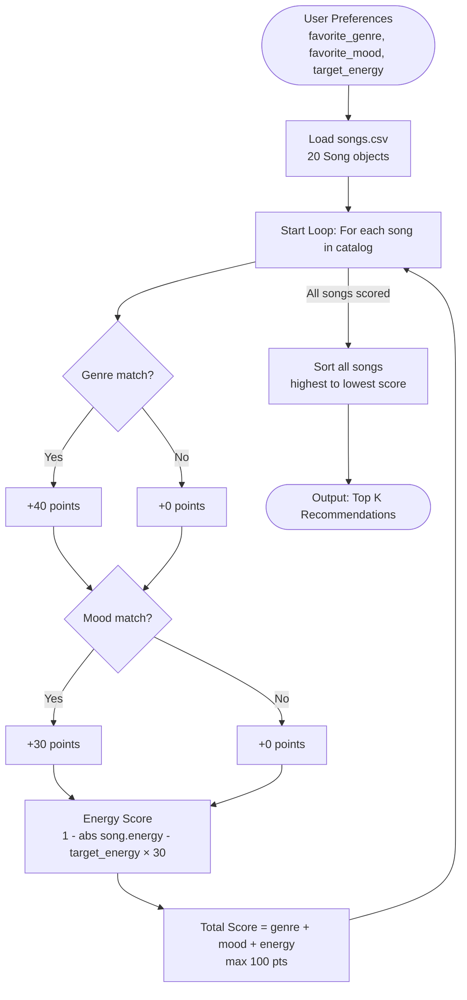
---

## Getting Started

### Setup

1. Create a virtual environment (optional but recommended):

   ```bash
   python -m venv .venv
   source .venv/bin/activate      # Mac or Linux
   .venv\Scripts\activate         # Windows

2. Install dependencies

```bash
pip install -r requirements.txt
```

3. Run the app:

```bash
python -m src.main
```

### Running Tests

Run the starter tests with:

```bash
pytest
```

You can add more tests in `tests/test_recommender.py`.

---

## Experiments You Tried

Use this section to document the experiments you ran. For example:

- What happened when you changed the weight on genre from 2.0 to 0.5
- What happened when you added tempo or valence to the score
- How did your system behave for different types of users

---

- Ran three standard profiles (High-Energy Pop, Chill Lofi, Deep Intense Rock) to confirm baseline scoring worked as expected and that well-matched profiles returned intuitive results
- Tested how the system behaved for edge-case user types: a user whose favorite genre doesn't exist in the catalog (k-pop), a user whose preferred mood doesn't exist (devastated), a high-energy sad user, and a user with no preferences at all — these revealed that missing genre or mood silently collapses scoring to energy only
- Ran the Energy Phantom test: two identical profiles with energy=0.01 and energy=0.99 to check whether changing the energy weight had any real effect on rankings — it did not, because the /10 divisor in the formula compresses all energy scores into a 0.90–1.00 range
- Temporarily removed the mood check from all three scoring functions to test what the rankings looked like without it — only one profile changed its #1 result, showing that genre weight so heavily dominates the score that mood rarely changes the outcome
- Observed that the Genre Tyrant profile (metal/calm/low energy) ranked Iron Cathedral #1 despite Glass Sonata matching mood and energy far better, which showed that reducing the genre weight would be a meaningful improvement worth trying next

## Limitations and Risks

Summarize some limitations of your recommender.

Examples:

- It only works on a tiny catalog
- It does not understand lyrics or language
- It might over favor one genre or mood

You will go deeper on this in your model card.

---


- Only works on a 20-song catalog — too small to provide real variety
- Genre match dominates scoring, so mood and energy preferences can be overridden
- A bug in the energy formula makes energy preference nearly meaningless in the dict-based scorer
- Does not consider lyrics, tempo, artist, or listening history
- Users whose favorite genre or mood isn't in the catalog get silently worse results
- The likes_acoustic preference is collected but never used in scoring
- No diversity — the same 5 songs will always appear for the same profile

## Reflection

Read and complete `model_card.md`:

[**Model Card**](model_card.md)

Write 1 to 2 paragraphs here about what you learned:

- about how recommenders turn data into predictions
- about where bias or unfairness could show up in systems like this


---

Building this recommender showed me that turning data into predictions is really just a series of design decisions dressed up as math. Every choice — which features to include, how many points to award a genre match versus a mood match, whether to divide by 10 or by 1 — directly shapes what gets recommended and to whom. The system doesn't have any real understanding of music; it just adds up numbers according to rules I wrote, which means any mistake or bias in those rules gets silently passed along to every recommendation the system makes.

The bias analysis was the most eye-opening part. I expected unfairness to look obvious, but most of it was invisible until I ran adversarial test cases. A quiet user and a loud user received nearly identical results because of a single division by 10. A user who wanted calm music got an intense metal song recommended because genre happened to match. Users of rare genres like jazz or classical were structurally penalized just because the catalog didn't have enough songs to represent them fairly. That made me realize that bias in AI systems often isn't intentional — it's a side effect of small decisions that compound, and you only find it by deliberately trying to break the system.


## 7. `model_card_template.md`

Combines reflection and model card framing from the Module 3 guidance. :contentReference[oaicite:2]{index=2}  

```markdown
# 🎧 Model Card - Music Recommender Simulation

## 1. Model Name

Give your recommender a name, for example:

> VibeFinder 1.0

---

## 2. Intended Use

- What is this system trying to do
- Who is it for

Example:

> This model suggests 3 to 5 songs from a small catalog based on a user's preferred genre, mood, and energy level. It is for classroom exploration only, not for real users.

---

## 3. How It Works (Short Explanation)

Describe your scoring logic in plain language.

- What features of each song does it consider
- What information about the user does it use
- How does it turn those into a number

Try to avoid code in this section, treat it like an explanation to a non programmer.

---

## 4. Data

Describe your dataset.

- How many songs are in `data/songs.csv`
- Did you add or remove any songs
- What kinds of genres or moods are represented
- Whose taste does this data mostly reflect

---

## 5. Strengths

Where does your recommender work well

You can think about:
- Situations where the top results "felt right"
- Particular user profiles it served well
- Simplicity or transparency benefits

---

## 6. Limitations and Bias

Where does your recommender struggle

Some prompts:
- Does it ignore some genres or moods
- Does it treat all users as if they have the same taste shape
- Is it biased toward high energy or one genre by default
- How could this be unfair if used in a real product

---

## 7. Evaluation

How did you check your system

Examples:
- You tried multiple user profiles and wrote down whether the results matched your expectations
- You compared your simulation to what a real app like Spotify or YouTube tends to recommend
- You wrote tests for your scoring logic

You do not need a numeric metric, but if you used one, explain what it measures.


## 8. Future Work

If you had more time, how would you improve this recommender

Examples:

- Add support for multiple users and "group vibe" recommendations
- Balance diversity of songs instead of always picking the closest match
- Use more features, like tempo ranges or lyric themes

---

## 9. Personal Reflection

A few sentences about what you learned:

- What surprised you about how your system behaved
- How did building this change how you think about real music recommenders
- Where do you think human judgment still matters, even if the model seems "smart"


The biggest learning moment was discovering that a single division by 10 in the energy formula made an entire preference signal nearly meaningless — and the system still looked like it was working until I ran tests designed to break it. AI tools helped me surface biases I wouldn't have thought to look for, like the acousticness preference being collected but never used, though I still had to read the actual code myself to verify the findings were real. What surprised me most was how "right" the recommendations felt for standard profiles, which made it easy to miss how badly the system failed for edge cases — simple algorithms can seem intelligent in the situations they were built for and quietly fail everywhere else. If I extended this project I would fix the energy formula, add acousticness as a real scoring signal, and add a diversity rule so the same genre can't dominate all five results.


Here is a picture that shows the results for a user with a pop/happy profile:
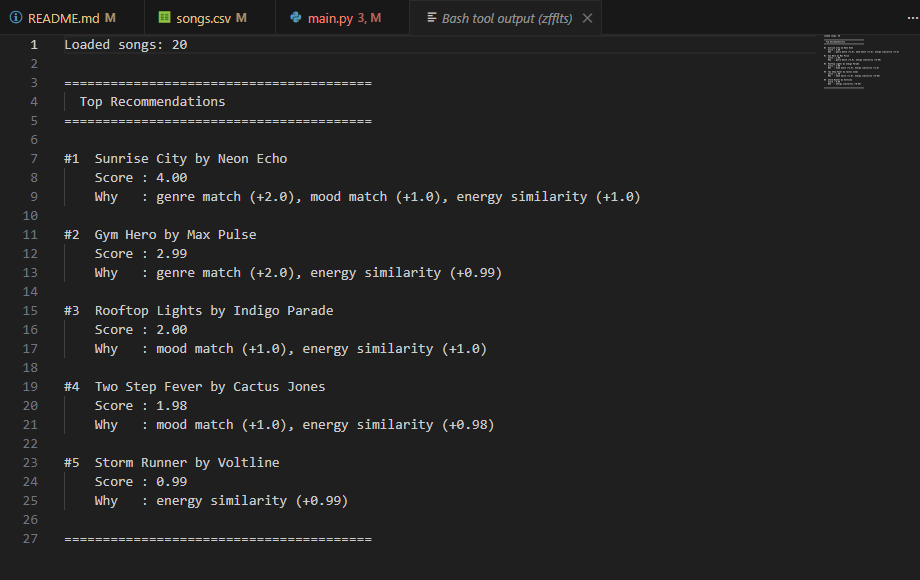
---

Here are the reccommendations for each profile:
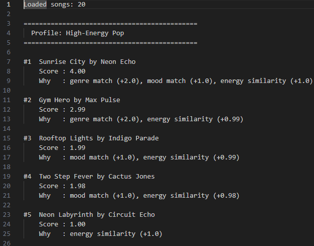
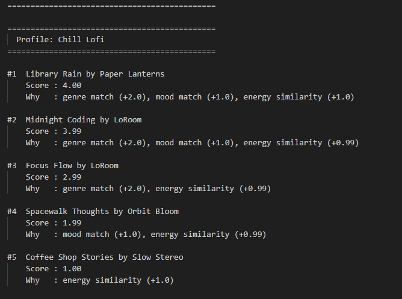
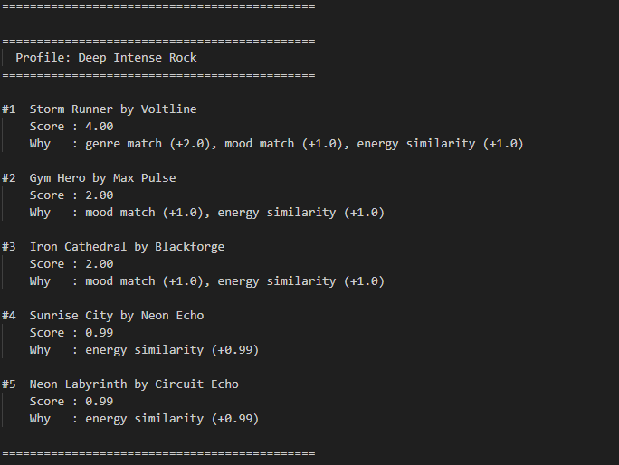
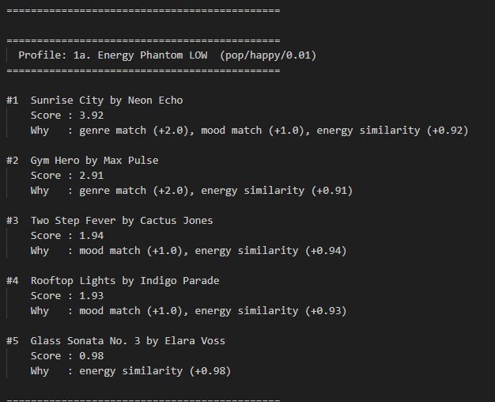
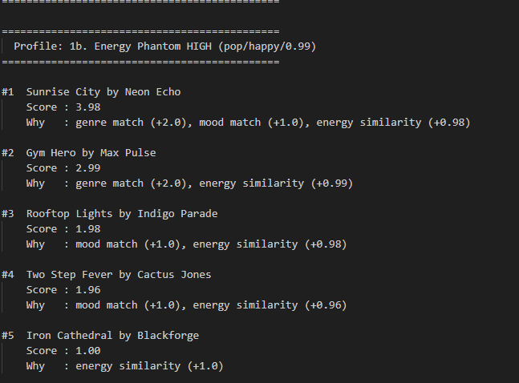
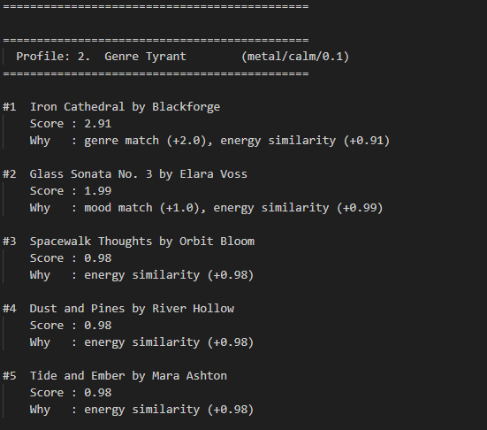
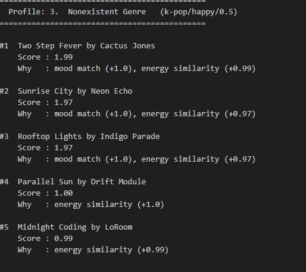
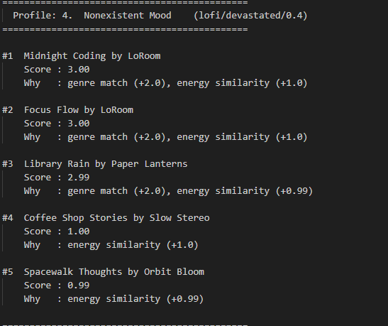
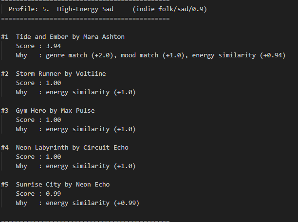
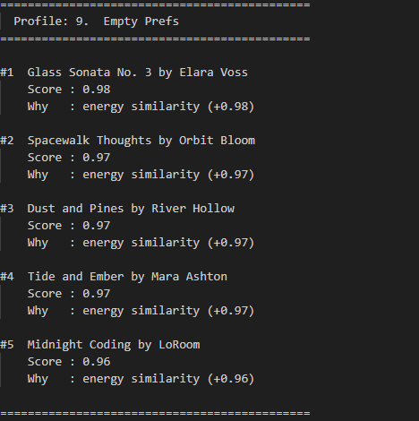

